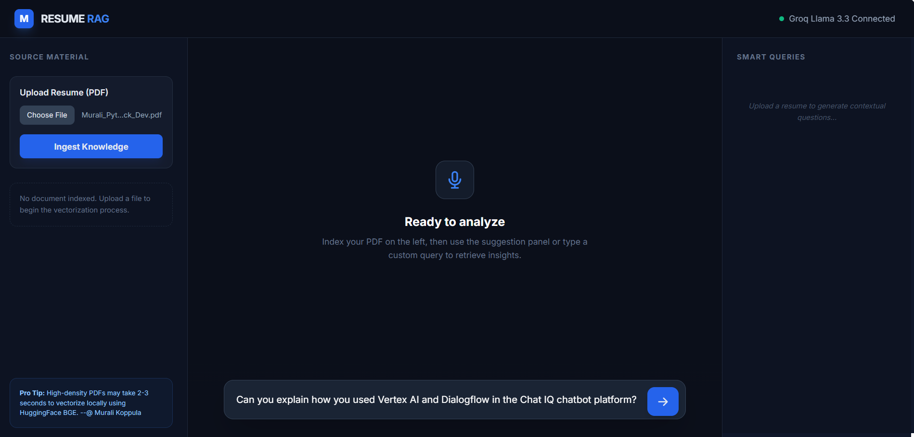
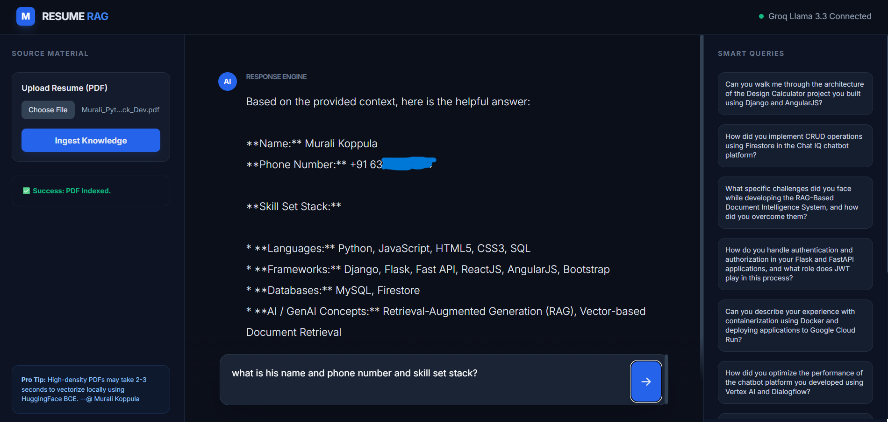

# 🤖 Resume RAG: Intelligent PDF Intelligence Assistant

[](https://www.python.org/)
[](https://flask.palletsprojects.com/)
[](https://groq.com/)
[](https://github.com/facebookresearch/faiss)

A high-performance **Retrieval-Augmented Generation (RAG)** application designed to transform static resumes into interactive, searchable intelligence. This project leverages **Groq's Llama 3.3** for near-instant inference and **HuggingFace BGE Embeddings** for precise semantic retrieval.

---

## 📺 Preview

### **The Intelligent Dashboard**

*Professional, dark-mode UI with sidebar navigation and contextual ready-states.*

### **Real-time Knowledge Extraction**

*AI Assistant generating "Smart Queries" and providing deep "AI Insights" based on resume content.*

---

## ✨ Key Features

- **🚀 Lightning-Fast Inference:** Utilizes Groq Cloud LPUs to achieve high-token-per-second responses.
- **🧠 Semantic Memory:** Implements conversation history to handle complex, multi-turn follow-up questions.
- **📂 Local Vector Indexing:** Uses FAISS and BGE-Small-En for lightweight, local vectorization—no external database costs.
- **🪄 Smart Query Generation:** Automatically analyzes the uploaded PDF to suggest the top 10 most relevant interview questions.
- **⚡ Async Processing:** Real-time loaders and feedback ensure a smooth, enterprise-grade user experience.

---

## 🛠️ Tech Stack

- **Backend:** Flask (Python)
- **Orchestration:** LangChain (LCEL)
- **LLM:** Llama 3.3 70B (via Groq)
- **Embeddings:** HuggingFace `BAAI/bge-small-en-v1.5`
- **Vector Store:** FAISS
- **Frontend:** Tailwind CSS, JavaScript (ES6+)

---

## 🚀 Getting Started

### 1. Prerequisites
- Python 3.9 or higher
- A Groq API Key ([Get one here](https://console.groq.com/))

### 2. Installation
```bash
# Clone the repository
git clone [https://github.com/murali457/Resume-RAG-GROQ.git](https://github.com/murali457/Resume-RAG-GROQ.git)
cd Resume-RAG-GROQ

# Install dependencies
pip install -r requirements.txt

------------------------------------------------------------------

## 👨‍💻 Author
**Murali Koppula** *Full Stack Python Developer | AI Enthusiast*

[](https://linkedin.com/in/murali-koppula06a1ba295)
[](https://github.com/murali457)